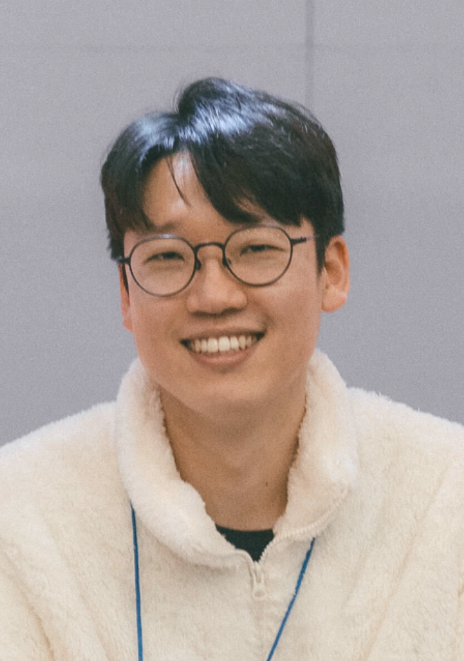

## About Me

Jeewoong Kim specializes in software testing and dynamic program analysis, with a focus on detecting, reproducing, and validating software bugs through automated techniques.

His research has covered real-world regression bug analysis, continuous fuzzing, and requirements-to-test traceability. He completed doctoral coursework and passed the comprehensive examination in Computer Science at [Chungbuk National University (CBNU)](https://www.cbnu.ac.kr), where he conducted software engineering research at the [SDEV lab](https://sdevlab.github.io) with his advisor [Shin Hong](https://hongshin.github.io).

📧 [jeewoong4@gmail.com](mailto:jeewoong4@gmail.com) 
  

## Technical Focus

- Dynamic Software Validation
- Regression & Defect Analysis
- Requirements-to-Test Traceability
  

## Selected Publications 

- Path-target Directed Greybox Fuzzing with Recursive Search Strategy, KCC'25
- Systematically Collecting Cross-project Bug Cases from OSS-Fuzz Test History, KCSE'25
- BugOss: A Benchmark of Real-world Regression Bugs for Empirical Investigation of Regression Fuzzing Techniques, JSS'24 \[[git](https://github.com/sdevlab/BugOss)\]  
- Inferring Fine-grained Traceability Links between Javadoc Comment and JUnit Test Code, ICSME-NIER'22 
- How Does a Unit-level Test Case for Continuous Fuzzing Evolve: An Empirical Study of Code Changes in OSS-Fuzz Projects, KCC'22 \[[pdf](/pubs/kcc22_oss-fuzz-change.pdf)\] 
    
